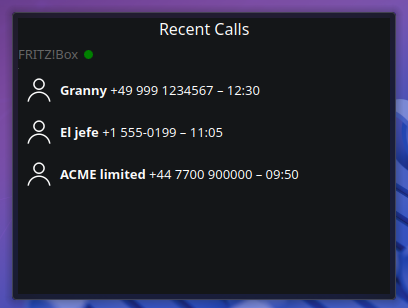
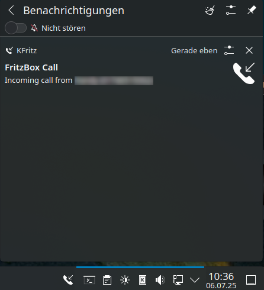
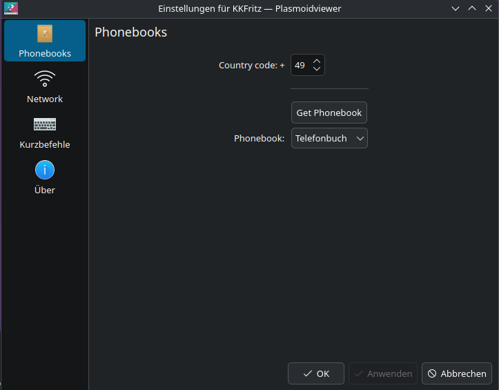

<div align="center">

 
  <h1>KFritz</h1> <p><strong>Version: 0.1.0</strong></p>
  <a href="https://kde.org/de/">
  
</a>
 <a href="https://www.gnu.org/licenses/gpl-3.0.html">
  
</a>
  <a href="https://paypal.me/agundur">
  
</a>
  </a>
  <a href="https://www.pling.com/p/2300820">
  

</div>


## Description
**KFritz** **Version:** 0.1.0

KFritz is a KDE Plasma 6 Plasmoid that connects to your AVM Fritz!Box and displays real-time incoming calls. It shows the caller name and number, maintains a history of recent calls, and integrates with the KDE notification system for alerts.

Designed for modern Plasma 6 environments, KFritz supports:
- Real-time call monitoring via the FritzBox CallMonitor 
- Caller name resolution from the FritzBox phonebook via TR-064
- Recent call history with timestamps
- Compact and full Plasma representations
- KDE notifications using KNotification

---

##  Homepage

 [https://www.agundur.de/](https://www.agundur.de/projects/fritzbox_callmonitor_for_kde.html)


## Visuals





## 🛠 Installation

### From source

```bash
git clone https://github.com/Agundur-KDE/kfritz.git
cd kfritz
mkdir -p build && cd build
cmake .. 
make
make install (as root) 
```
## 🛠️ Installing KFritz via the openSUSE Build Service Repository

[](https://build.opensuse.org/package/show/home:Agundur/KFritz)

For openSUSE Tumbleweed (and compatible systems):

```bash
# Add the repository
sudo zypper ar -f https://download.opensuse.org/repositories/home:/Agundur/openSUSE_Tumbleweed/home:Agundur.repo

# Automatically import GPG key (required once)
sudo zypper --gpg-auto-import-keys ref

# Refresh repository metadata
sudo zypper ref

# Install KFritz
sudo zypper in kfritz
```

##  Installing KFritz via my COPR repository (Fedora)

```bash
# Enable repository
sudo dnf copr enable agundur/kfritz
# Install package
sudo dnf install kfritz
```

## Install on Debian (Trixie)

### Prerequisites

- You’re running KDE Plasma 6 on Debian 13 (Trixie) — e.g. on plasma-desktop / plasma-workspace.

- Architecture: packages provided are amd64 (x86-64).

Download the .deb from the project’s GitHub Release page, then:

```bash
sudo apt install ./kfritz_0.1.0-1_amd64.deb
```

### Required
    
- KDE Plasma 6.4+

- Qt 6.6+

- A Fritz!Box with:

    - TR-064 enabled

    - CallMonitor enabled (see below)

    - A user account with appropriate permissions

## Tested Hardware/Software

🛒[FRITZ!Box 6690 Cable](https://amzn.to/3Iwsnog) (Affiliate link).

🛒[FRITZ!Box 6660 Cable](https://amzn.to/3Uxnxu2) (Affiliate link).


FritzOS 7.57 and 8.03


## FritzBox Setup

- KFritz uses two interfaces of the Fritz!Box:

    - The CallMonitor on port 1012 for incoming call events

    - The TR-064 API for phonebook name resolution

- Enable CallMonitor

    - Connect a telephone to your Fritz!Box (can be a DECT handset or analog phone).

    - Dial: #96\*5\*

      This enables the call monitor on port 1012.

      To disable it again: #96\*0\*

      This only needs to be done once. The setting persists after reboot.

# Enable TR-064

- Open Fritz!Box web interface: http://fritz.box

- Go to Home Network > Network > Network Settings

- Scroll down to "Home network sharing" (Heimnetzfreigabe)

- Check: ✅ "Allow access for applications (TR-064)"


# Create a dedicated user

- Go to System > Fritz!Box Users

- Click on "Add User"

    - Choose:

        Username: kfritz (recommended)

        Password: [Choose a strong password]

    - Permissions:

        ✅ "Read access to call list and phonebook"

    This user will be used by KFritz to authenticate via TR-064 and download the phonebook.

# Configuration

When you add the KFritz Plasmoid to your panel or desktop:
Right-click and open Configure KFritz

    on network set:

        Host (usually 192.168.178.1)

        Port: 49000 (default for TR-064)

        Username and Password (as created above)

    Save and exit
    
     on phonebook set:

        your telephony county code
        
        and download/choose your phonebook
        
This only needs to be done once. The setting persists after reboot.

    Save and exit


## Support

- Open an issue on git ...

[KFritz Issues](https://github.com/Agundur-KDE/kfritz/issues)


## Roadmap

Tell me what you would like to see

## Contributing
accepting contributions ...

[KFritz](https://github.com/Agundur-KDE/kfritz)


## Authors and acknowledgment
Alec

## License
GPL


## Project status
active
