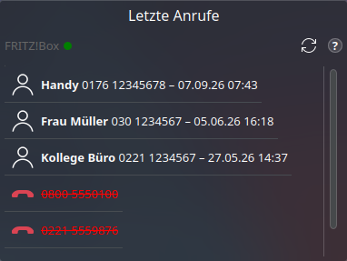
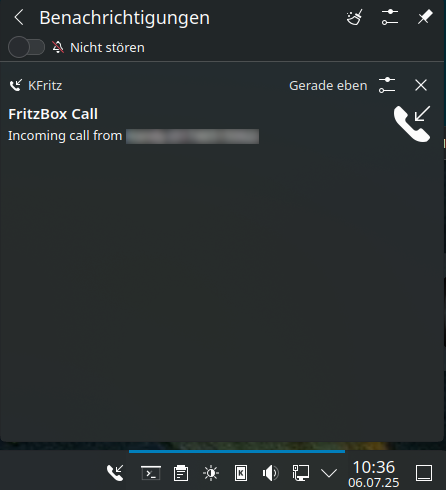
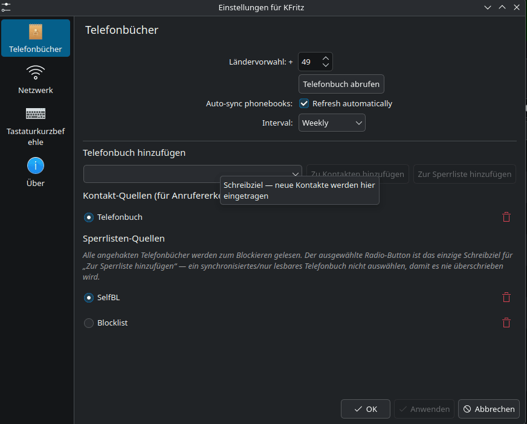

<div align="center">
  
  <h1>KFritz</h1>
  <p>KDE Plasma 6 panel widget for your AVM FRITZ!Box call monitor.</p>
  <a href="https://kde.org/de/">
    
  </a>
  <a href="https://www.gnu.org/licenses/gpl-3.0.html">
    
  </a>
  <a href="https://build.opensuse.org/package/show/home:Agundur/KFritz">
    
  </a>
  <a href="https://paypal.me/agundur">
    
  </a>
</div>

KFritz is a KDE Plasma 6 widget that connects to your AVM FRITZ!Box and
shows real-time incoming calls: caller name and number, call history, and
KDE notifications — with a sound, and quick actions to add unknown callers
to your phonebook or block them.

## Visuals





## What it does

- **Real-time call monitoring** via the FritzBox's CallMonitor port.
- **Caller name resolution** from one or more FritzBox phonebooks (TR-064) —
  configure which phonebook(s) to check under Settings › Contacts sources.
- **Blocklist support**: a number found in any configured blocklist
  phonebook is fully silent (no popup, no sound) and shows red/struck-through
  in the call list — instead of a designated "block all numbers" phonebook,
  since AVM's built-in call-barring feature caps out at 32 entries, too few
  for an internet-sourced spam list.
- **Sound + KDE notification** on incoming calls (skipped for blocked ones).
- **Quick actions** on an unrecognized caller: "Add to Contacts" (with a
  name field and number type) or "Add to Blocklist" — each writes to one
  designated phonebook per role, so a WebDAV-synced blocklist that gets
  overwritten on every sync can stay a read-only source while a
  hand-maintained one takes new entries.
- **Missed-call catch-up**: calls that came in while the widget wasn't
  running are fetched from the FritzBox's own call list on startup.
- Compact and full Plasma representations.

## Requirements

- KDE Plasma 6.1+, Qt ≥ 6.7, KDE Frameworks ≥ 6.10
- A FRITZ!Box with:
  - CallMonitor enabled (see below)
  - TR-064 enabled
  - A user account with phonebook/call-list read permission

## Install

Grab the `.deb`/`.rpm` from the
[latest release](https://github.com/Agundur-KDE/kfritz/releases/latest), or:

```bash
# openSUSE Tumbleweed
sudo zypper ar -f https://download.opensuse.org/repositories/home:/Agundur/openSUSE_Tumbleweed/home:Agundur.repo
sudo zypper --gpg-auto-import-keys ref
sudo zypper in kfritz
```

```bash
# Debian 13 (Trixie) / compatible — download the .deb from the release page, then:
sudo apt install ./kfritz_*.deb
```

Unlike the other Agundur-KDE plasmoids, KFritz has a real compiled C++
plugin (phonebook/TR-064 handling), so there's no `.plasmoid`/GHNS install —
building from source needs the full toolchain:

```bash
git clone https://github.com/Agundur-KDE/kfritz.git
cd kfritz
mkdir build && cd build
cmake .. -DCMAKE_BUILD_TYPE=Release
make
sudo make install
```

## Tested Hardware/Software

FritzOS 7.57 and 8.03.

🛒 [FRITZ!Box 6690 Cable](https://www.amazon.de/s?k=FRITZ%21Box+6690+Cable)
🛒 [FRITZ!Box 6660 Cable](https://www.amazon.de/s?k=FRITZ%21Box+6660+Cable)

## FritzBox Setup

KFritz uses two interfaces of the FRITZ!Box:
- The CallMonitor on port 1012 for incoming call events
- The TR-064 API for phonebook name resolution, blocklist checks, and
  the "Add to Contacts"/"Add to Blocklist" actions

### Enable CallMonitor

Connect a telephone to your FRITZ!Box (DECT handset or analog), then dial:

```
#96*5*
```

This enables the call monitor on port 1012 (persists across reboots).
To disable it again: `#96*0*`.

### Enable TR-064

FRITZ!Box web interface (`http://fritz.box`) → Home Network › Network ›
Network Settings → "Home network sharing" (Heimnetzfreigabe) → enable
"Allow access for applications (TR-064)".

### Create a dedicated user

System › FRITZ!Box Users → Add User:
- Username: `kfritz` (recommended)
- Permissions: "Read access to call list and phonebook"

This user authenticates KFritz's TR-064 calls (phonebook download, blocklist
checks, adding contacts).

## Configuration

Right-click the widget → Configure KFritz:

- **Network**: Host (usually `192.168.178.1`), Port (`49000` default),
  Username/Password (the dedicated user created above)
- **Phonebook**: country code, then assign one or more downloaded
  phonebooks to the "Contacts" role (used for caller ID) and/or the
  "Blocklist" role (checked first on every call) — each role has one
  designated write target for the quick-action buttons

Only needs to be done once, settings persist across reboots.

## Support

Open an issue: [KFritz Issues](https://github.com/Agundur-KDE/kfritz/issues)

## Contributing

Fork and adapt freely.

## License

GPL-3.0-or-later
